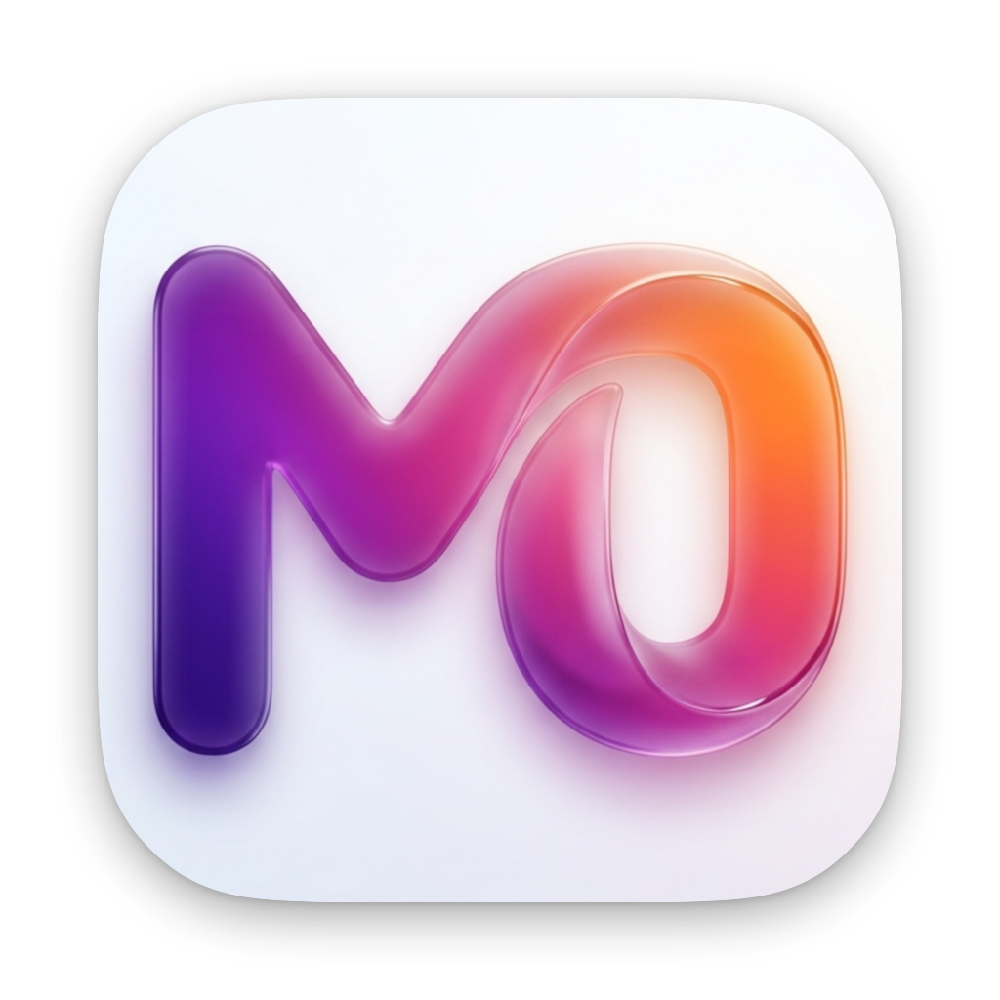
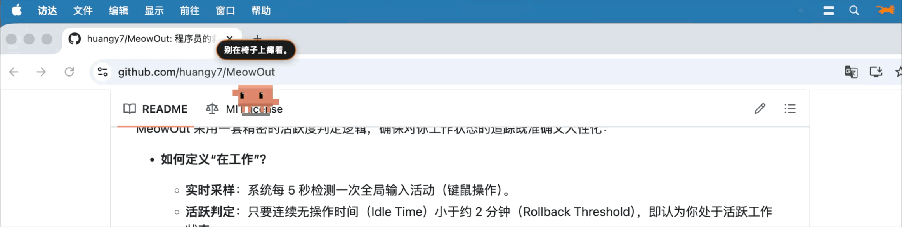

<p align="center">
  
</p>

# MeowOut

<p align="center">
  <b>一只奔跑的像素伴侣，守护你的职场健康</b>
  <br>
  <a href="LICENSE"></a>
  
  
</p>

<p align="center">
  
</p>

<p align="center">
  <a href="https://meow.huangy.top/">
    
  </a>
  &nbsp;
  <a href="https://meow.huangy.top/#demo">
    
  </a>
  &nbsp;
  <a href="https://github.com/huangy7/MeowOut/releases/latest">
    
  </a>
</p>

MeowOut 是一款 macOS 原生菜单栏应用，用一只奔跑的像素宠物提醒你按时休息与喝水。它通过系统底层接口精准检测用户活跃度，根据连续工作时长自动进入预警、强制休息或正念练习阶段，是开发者预防颈椎病、保持水分充足的贴心健康伙伴。


## ✨ 核心特性

| 特性 | 说明 |
| :--- | :--- |
| **多样化像素伙伴** | 内置 **Clawd (小猫)**、**Panda (熊猫)**、**Pika (皮卡)** 等多款宠物，支持实时切换与独立动画。 |
| **硬核防沉迷算法** | **时光回滚**: 精准扣除起座初期的“幽灵时间”；**满血复活**: 强制休息阈值确保工作循环科学重置。 |
| **全能提醒系统** | **喝水提醒**: 支持“跟随工作节奏”或“自定义间隔”双模式，并在菜单栏实时显示饮水进度。<br>**过度工作监控**: 新增 30 秒观察窗口，人性化判定是否真正进入休息状态。 |
| **正念练习 (Mindfulness)** | 集成 5 分钟呼吸训练模块，支持全屏沉浸式交互，练习数据自动同步至健康统计。 |
| **MemosKit 闪念胶囊** | 全新原生备忘录架构，支持 Markdown 渲染、时间轴与日历双视图，并集成图片附件管理。 |
| **剪贴板历史 (Clipboard)** | 独立、轻量的剪贴板管理工具，支持纯文本、富文本与图片的搜索、预览与极速操作。 |
| **Toolbox 2FA** | 内置安全的双因素验证器，支持多哈希算法及 Keychain 加密存储。 |
| **KeyDrop & Launcher** | 快捷的文本片段管理器与长按触发的环形启动器，将最高频操作置于指尖。 |
| **清洁模式 (Cleaning)** | 一键锁定键盘或屏幕输入，防止清洁时误触，并提供倒计时解锁机制。 |
| **现代化管理面板** | 采用侧边栏导航架构，提供深度个性化的 **休息/饮水/行为/系统** 设置，以及详尽的 **今日回顾时间轴**。 |


## 🕰 监测逻辑说明

MeowOut 采用一套精密的活跃度判定逻辑，确保对你工作状态的追踪既准确又人性化：

- **如何定义“在工作”？**
  - **实时采样**：系统每 5 秒检测一次全局输入活动（键鼠操作）。
  - **状态演进**：累计工作时间达到预警阈值时，宠物会切换台词提醒；达到最大时长时，强制进入休息模式。
  - **过度工作阶段**：新增 `Overworking` 状态，如果你在休息提醒弹出后仍坚持工作，宠物会根据你的设置展现不同的性格反馈。

- **喝水提醒逻辑**
  - **跟随节奏模式**：在每次从休息状态恢复到工作状态时，由宠物提醒你补水。
  - **自定义间隔**：固定时间频率提醒，确保水分摄入均匀。

- **如何判定“休息够了”？**
  - **正念练习**：完成一次呼吸训练可快速重置状态。
  - **自然挂机 (Idle Reset)**：完全不操作电脑超过设定阈值，系统判定你已起座休息。
  - **时光回滚 (Rollback)**：如果短暂离开（如接电话），系统会自动扣除该时间段，防止计时虚高。


## 🚀 安装指南 (Installation)

### 使用 Homebrew 安装 (推荐) 🍺

如果你的 Mac 上已安装 Homebrew，可以通过我们的专属 Tap 一键安装和更新：

```bash
brew install huangy7/tap/meowout
```

---

### 下载安装包

1. **[下载最新的 MeowOut.dmg](https://github.com/huangy7/MeowOut/releases/latest)**
2. **移除隔离属性** (未签名的应用需要执行此操作):
   ```bash
   cd ~/Downloads
   xattr -cr MeowOut*.dmg
   ```
3. **打开** 下载好的 DMG 文件并拖拽 `MeowOut.app` 到 `Applications` 文件夹。

### 极速一键安装

```bash
curl -L https://github.com/huangy7/MeowOut/releases/latest/download/MeowOut.dmg -o ~/Downloads/MeowOut.dmg && xattr -cr ~/Downloads/MeowOut.dmg && open ~/Downloads/MeowOut.dmg
```

## 🛠️ 技术栈
- **UI 框架**: SwiftUI (现代侧边栏导航 + 响应式布局)
- **底层架构**: AppKit (多窗口协同 + 全屏置顶遮罩)
- **状态管理**: Swift Observation (@Observable)
- **绘图引擎**: Canvas (高性能像素动画渲染，30FPS 功耗平衡)
- **内容渲染**: 依赖 MarkdownUI 构建原生 Markdown 交互体验
- **安全保障**: 基于 SwiftOTP 提供 TOTP 支持，依托 KeychainService 保护密钥
- **本地化**: 完整支持中英文切换，适配系统语言。


## 📂 项目结构
```text
Sources/MeowOut/
  AppState.swift              # 全局业务逻辑与持久化中心
  PetState.swift              # 宠物状态机与动画数据源
  ActivityMonitor.swift       # 核心活跃度检测与时间回滚算法
  CatOverlayController.swift  # 浮窗管理与全屏交互控制器
  WaterReminderController.swift # 独立的饮水逻辑控制器
  ClawdView.swift / PandaView.swift / PikaView.swift # 各类宠物视图组件
  Memos/                      # MemosKit 闪念胶囊核心视图与逻辑
  Clipboard/                  # 原生剪贴板历史管理与视图模块
  Toolbox2FA/                 # 二步验证器核心模块与视图
  KeyDrop/                    # 文本片段管理器核心模块
  SettingsView.swift          # 现代化侧边栏设置面板
  StatsView.swift             # 多维度健康统计页面
  TodayReviewView.swift       # 每日行为记录可视化时间轴
  LauncherView.swift          # 快捷环形启动器入口
  KeyboardCleaningService.swift # 键盘清洁模式核心逻辑
  ScreenCleaningService.swift   # 屏幕清洁模式核心逻辑
```


## ⚖️ 开源协议

本项目代码基于 [MIT](LICENSE) 协议。

---

<p align="center">
  由 <a href="https://github.com/huangy7">huangy7</a> 开发并维护
</p>
