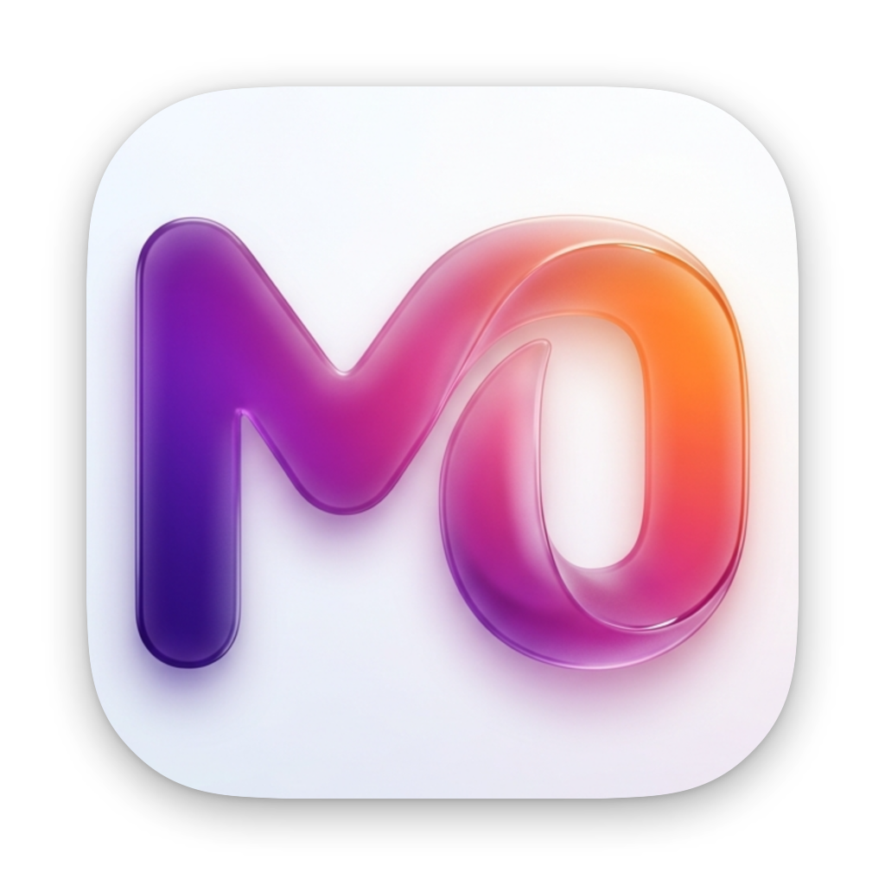
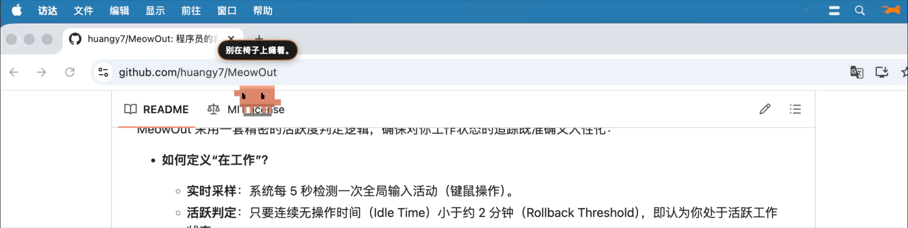

<p align="center">
  
</p>

<p align="center">
  <a href="README.md"></a>
  <a href="README.zh-CN.md"></a>
</p>

# MeowOut

<p align="center">
  <b>A running pixel companion that guards your health at work</b>
  <br>
  <a href="LICENSE"></a>
  
  
</p>

<p align="center">
  
</p>

<p align="center">
  <a href="https://meow.huangy.top/">
    
  </a>
  &nbsp;
  <a href="https://meow.huangy.top/#demo">
    
  </a>
  &nbsp;
  <a href="https://github.com/huangy7/MeowOut/releases/latest">
    
  </a>
</p>

MeowOut is a native macOS menu bar app where a running pixel pet reminds you to take breaks and drink water on schedule. It precisely detects user activity through low-level system APIs and automatically escalates through warning, forced-break, and mindfulness stages based on continuous work time — a thoughtful health companion that helps developers prevent neck strain and stay hydrated.


## ✨ Key Features

| Feature | Description |
| :--- | :--- |
| **Diverse Pixel Companions** | Built-in pets including **Clawd (Cat)**, **Panda**, and **Pika**, with live switching and independent animations. |
| **Hardcore Anti-Grind Algorithm** | **Time Rollback**: precisely deducts "ghost time" when you briefly step away; **Full Reset**: a forced-break threshold ensures every work cycle resets scientifically. |
| **Comprehensive Reminders** | **Water Reminder**: "follow work rhythm" or "custom interval" modes, with live hydration progress in the menu bar.<br>**Overwork Monitor**: a 30-second grace window that humanely determines whether you've actually started resting. |
| **Mindfulness** | An integrated 5-minute breathing module with fullscreen immersive interaction; session data syncs to health statistics automatically. |
| **MemosKit Quick Memos** | A new native memo architecture with Markdown rendering, timeline and calendar dual views, and image attachment management. |
| **Clipboard History** | A standalone, lightweight clipboard manager supporting search, preview, and instant actions for plain text, rich text, and images. |
| **Dropzone** | A natively integrated drag-and-drop staging area for files — multi-file staging, quick drag-out, and preview for smooth cross-app file flow. |
| **Toolbox 2FA** | A built-in secure TOTP authenticator with multiple hash algorithms and Keychain-encrypted storage. |
| **KeyDrop & Launcher** | A quick text-snippet manager and a long-press radial launcher that put your most frequent actions at your fingertips. |
| **Cleaning Mode** | One-click keyboard or screen input lock to prevent accidental keystrokes while cleaning, with a countdown unlock. |
| **Clamshell Keep-Awake & Battery Protection** | Prevents sleep with the lid closed, with a customizable battery threshold to avoid over-discharge. |
| **Modern Management Panel** | A sidebar-navigation architecture offering deeply customizable **Rest / Hydration / Behavior / System** settings and a detailed **Today Review** timeline. |


## 🕰 How Activity Detection Works

MeowOut uses a precise activity-detection pipeline to track your work state accurately and humanely:

- **What counts as "working"?**
  - **Real-time sampling**: global input activity (keyboard & mouse) is checked every 5 seconds.
  - **State progression**: when accumulated work time reaches the warning threshold, the pet switches its dialogue to remind you; at the maximum duration, it forces a break.
  - **Overworking stage**: an `Overworking` state — if you keep working after the break reminder appears, the pet reacts with different personalities based on your settings.

- **Water reminder logic**
  - **Follow-rhythm mode**: the pet reminds you to hydrate each time you return from a break.
  - **Custom interval**: fixed-frequency reminders to keep your hydration evenly distributed.

- **What counts as "rested enough"?**
  - **Mindfulness**: completing a breathing session quickly resets your state.
  - **Idle Reset**: no input beyond a configurable threshold means the system treats you as having stepped away.
  - **Time Rollback**: short absences (e.g., taking a phone call) are automatically deducted so your work timer never inflates.


## 🚀 Installation

### Install via Homebrew (Recommended) 🍺

If you have Homebrew installed, install and update through our dedicated tap:

```bash
brew install huangy7/tap/meowout
```

---

### Download the DMG

1. **[Download the latest MeowOut.dmg](https://github.com/huangy7/MeowOut/releases/latest)**
2. **Remove the quarantine attribute** (required for unsigned apps):
   ```bash
   cd ~/Downloads
   xattr -cr MeowOut*.dmg
   ```
3. **Open** the DMG and drag `MeowOut.app` into your `Applications` folder.

### One-Line Quick Install

```bash
curl -L https://github.com/huangy7/MeowOut/releases/latest/download/MeowOut.dmg -o ~/Downloads/MeowOut.dmg && xattr -cr ~/Downloads/MeowOut.dmg && open ~/Downloads/MeowOut.dmg
```

## 🛠️ Tech Stack
- **UI Framework**: SwiftUI (modern sidebar navigation + responsive layout)
- **Low-Level Architecture**: AppKit (multi-window coordination + fullscreen always-on-top overlays)
- **State Management**: Swift Observation (@Observable)
- **Rendering Engine**: Canvas (high-performance pixel animation, 30FPS power-balanced)
- **Content Rendering**: MarkdownUI for a native Markdown experience
- **Security**: TOTP via SwiftOTP, secrets protected by Keychain
- **Localization**: Full English / Simplified Chinese switching, following the system language


## 📂 Project Structure
```text
Sources/MeowOut/
  AppState.swift              # Global business logic & persistence hub
  PetState.swift              # Pet state machine & animation data source
  ActivityMonitor.swift       # Core activity detection & time-rollback algorithm
  CatOverlayController.swift  # Floating window & fullscreen interaction controller
  WaterReminderController.swift # Standalone hydration logic controller
  ClawdView.swift / PandaView.swift / PikaView.swift # Pet view components
  Memos/                      # MemosKit quick-memo views & logic
  Clipboard/                  # Native clipboard history module
  Toolbox2FA/                 # TOTP authenticator module & views
  KeyDrop/                    # Text-snippet manager module
  SettingsView.swift          # Modern sidebar settings panel
  StatsView.swift             # Multi-dimensional health statistics
  TodayReviewView.swift       # Daily activity timeline visualization
  LauncherView.swift          # Quick radial launcher
  KeyboardCleaningService.swift # Keyboard cleaning mode logic
  ScreenCleaningService.swift   # Screen cleaning mode logic
```


## ⚖️ License

This project is released under the [MIT](LICENSE) License.

---

<p align="center">
  Developed and maintained by <a href="https://github.com/huangy7">huangy7</a>
</p>
